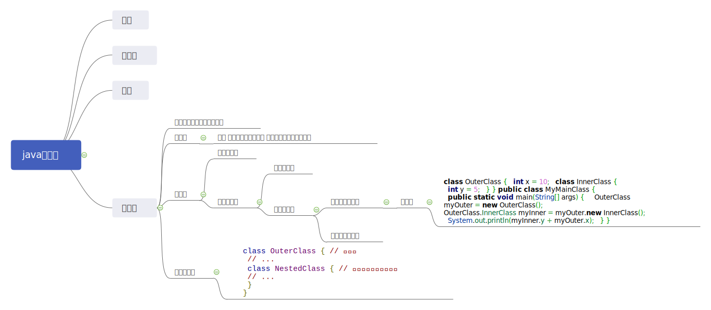

## 常用类


#### 根类

#### 包装类

#### 日期类

#### 内部类

```xml
内部类可以随意使用外部类的成员变量（包括私有）而不用生成外部类的对象，这也是内部类的唯一优点

创建静态内部类对象的一般形式为： 外部类类名.内部类类名 xxx = new 外部类类名.内部类类名()

创建成员内部类对象的一般形式为： 外部类类名.内部类类名 xxx = 外部类对象名.new 内部类类名()
```




##### 实例成员内部类

```java
class OuterClass {
  int x = 10;

  class InnerClass {
    int y = 5;
  }
}

public class MyMainClass {
  public static void main(String[] args) {
    OuterClass myOuter = new OuterClass();
    OuterClass.InnerClass myInner = myOuter.new InnerClass();
    System.out.println(myInner.y + myOuter.x);
  }
}
```

#####  静态内部类

```java
class OuterClass {
  int x = 10;

  static class InnerClass {
    int y = 5;
  }
}

public class MyMainClass {
  public static void main(String[] args) {
    OuterClass.InnerClass myInner = new OuterClass.InnerClass();
    System.out.println(myInner.y);
  }
}
```

局部内部类

```java
class Out {
    private int age = 12;
 
    public void Print(final int x) {
        class In {
            public void inPrint() {
                System.out.println(x);
                System.out.println(age);
            }
        }
        new In().inPrint();
    }
}
 
public class Demo {
    public static void main(String[] args) {
        Out out = new Out();
        out.Print(3);
    }
}
```

匿名内部类

```xml
在编写事件监听的代码时使用匿名内部类不但方便，而且使代码更加容易维护。下面这段代码是一段 Android 事件监听代码：
```


```java
scan_bt.setOnClickListener(new OnClickListener() {
    @Override
    public void onClick(View v) {
        // TODO Auto-generated method stub
         
    }
});
 
history_bt.setOnClickListener(new OnClickListener() {
     
    @Override
    public void onClick(View v) {
        // TODO Auto-generated method stub
         
    }
});

/**
* 匿名内部类的使用。代码中需要给按钮设置监听器对象，使用匿名内部类能够在实现父类或者接口中的方法情况下同时产生一个相应的对象，但是前提是这个父类或者接口必须先存在才能这样使用
*/

如下为相同的实现 但是冗杂
private void setListener()
{
    scan_bt.setOnClickListener(new Listener1());       
    history_bt.setOnClickListener(new Listener2());
}
 
class Listener1 implements View.OnClickListener{
    @Override
    public void onClick(View v) {
    // TODO Auto-generated method stub
             
    }
}
 
class Listener2 implements View.OnClickListener{
    @Override
    public void onClick(View v) {
    // TODO Auto-generated method stub
             
    }
}
```

```xml
声明匿名对象：
new Inner().display(); 
实例化对象后 立即调用方法 只运行一次

正常为：
Inner inner = new Inner();
inner.display();
```

