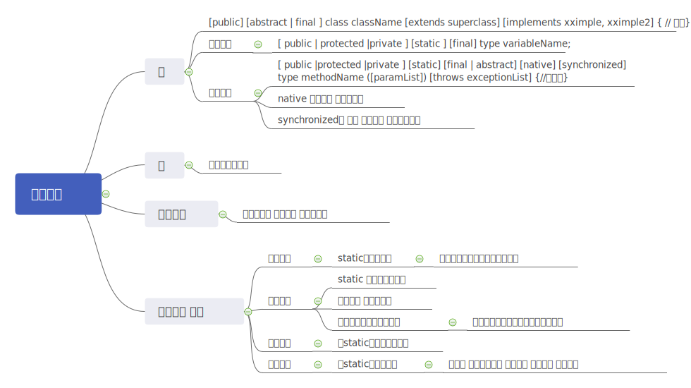
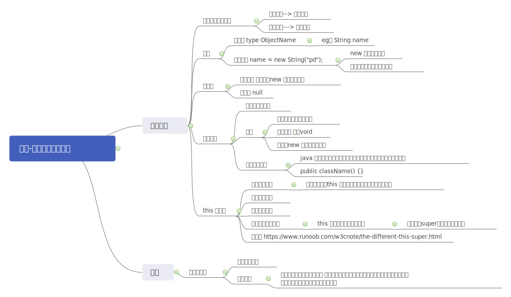

## 面向对象

#### 简介：

```xml
简介：oop
类 抽象的描述
对象、实例 ：具体的个体
特性：封装、继承、多态
父类、子类 java单继承  可实现多个接口
```




| 等级        | 同一个类 | 同一个包 | 不同包的子类 | 不同包非子类 |
| ----------- | -------- | -------- | ------------ | ------------ |
| 私有private | 可以     |          |              |              |
| default     | 可以     | 可以     |              |              |
| protected   | 可以     | 可以     | 可以         |              |
| public      | 可以     | 可以     | 可以         | 可以         |


#### 对象创建 使用 销毁

